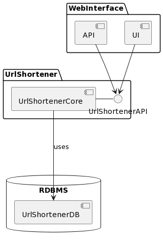

### Algorythm
-------------
The shortened urls will be a conseqcutive series of base62 case sensitive alphanumerical strings.
The algorythm will create shortened urls for each url by incrementing the previous shortened url using the next character from the base 62 alphabet.

The base 62 alphabet will be:
0, 1, 2, ..., 9, a, b, c, ..., y, z, A, B, C, ..., Y, Z (10 + 26 + 26 = 62)

Source of algorythm:
https://en.wikipedia.org/wiki/URL_shortening

Genesis Record:
- The genesis record for the Url Shortener will be: '0'

Encoding Urls:
- If the Url exists in the DB then return the already encoded value for it.
- If the Url doesn't exist in the DB then it will read the last saved tiny URL and increment it. The newly incremented string will be the new shortened URL, then save the URL/shortenedURL pair into the DB.

Correctness of the Algorythm:
- Since the Encoded URLs are always an incrementing sequences of base62 chars they will always be unique, therefore there will always be a 1-1 mapping from URL to shortenedURL.

Scalability:
- The scalability will be simply ensured by the introduction of another base62 digit.
- Example: in the begining only one base62 digit will be used for encryption. That will be enough for encoding only 62 URLs. The 63rd URL will use 2 base62 alphanumerical case sensitive characters.
- The number of encodable URLs would be 62 on the power of number of base62 alphanumerical case sensitive characters. For 6 such 'chars' the maximum representable URLs will be: 56'800'235'584. (56+ billion). By the introduction of another 7th base62 alphanumerical case sensitive character we will expand the shortanable URLs.

Architecture:
-------------------


- As seen in the above diagram the url shortener consists of a core which contains the base62 counter and its API: encode/decode
- Then there is a web-interface which consists of 2 part:
  - simple UI: intended to be used by humans.
  - http based API: with 2 endpoints: /encode /decode. Intended to be consumed by 3rd parties.

- Technologies used
	- Url Shortener module
		- pure ruby for the url-shortener
		- repository for a relational DB using romrb for persisting the encoded urls in the url-shortener (repository pattern instead of the infinite interface of ActiveRecord)
	- Web Interface module
		- Grape based DSL for the http based API
		- slim markup for rendering the human consumable UI
		- no AR
		- Capibara to spec the human readable UI
		- Request specs to spec the http based API
	- make files to run all the specs at one snap
	- postgres as persistent storage
- Run the project: 
	- create the db for testing: shortened_urls_test
	- create the db for dev:  shortened_urls_development
	- create a .env file based on url-shortener/.env.example
	- run `bundle install` both in `url-shortener` and `web-interface` directories
	- in the url-shortener directory run: `bundle exec rake db:migrate` and `ENVIRONMENT=test bundle exec rake db:migrate`
	- in the main directory run `make test`  everything should pass like here:
	 ```
    make test
    Finished in 2.69 seconds (files took 0.95764 seconds to load)
    8 examples, 0 failures
    ..................
    Finished in 2.07 seconds (files took 0.39583 seconds to load)
    18 examples, 0 failures
`

- 
	- run web-interface: in the `web-interface` directory run: `bundle exec rails s` 
	- at this point you can browse the url-shortener by visiting: `http://localhost:3000/short_urls`
	- you can call the api endpoints manually with curl command by:  `curl -X POST http://localhost:3000/encode -H 'Content-Type: application/json' -d '{"url":"https://www.linkedin.com/in/orbanbotond/"}'`
	- Then You should get back a shortened url like: `{"encoded_url":"http://tny.cm/b"}`
	- Then You can decode this url back to the original like: `curl -X POST http://localhost:3000/decode -H 'Content-Type: application/json' -d '{"url":"http://tny.cm/b"}'`
	- And You should receive the original url in a json format like: `{"decoded_url":"https://www.linkedin.com/in/orbanbotond/"}`
